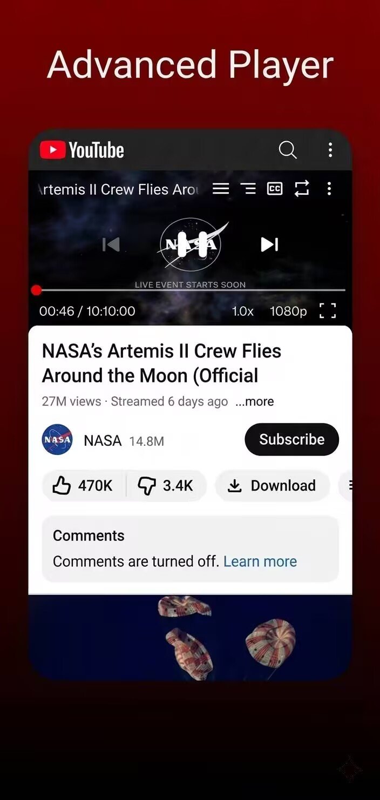
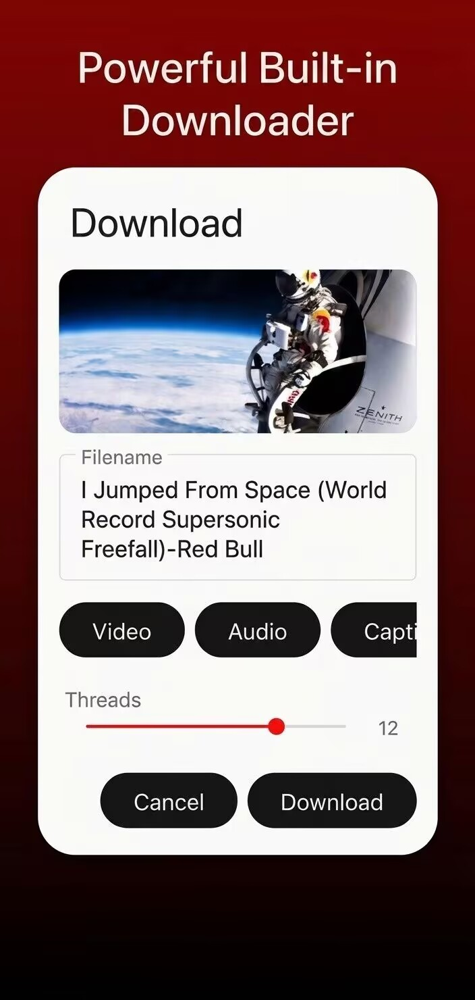
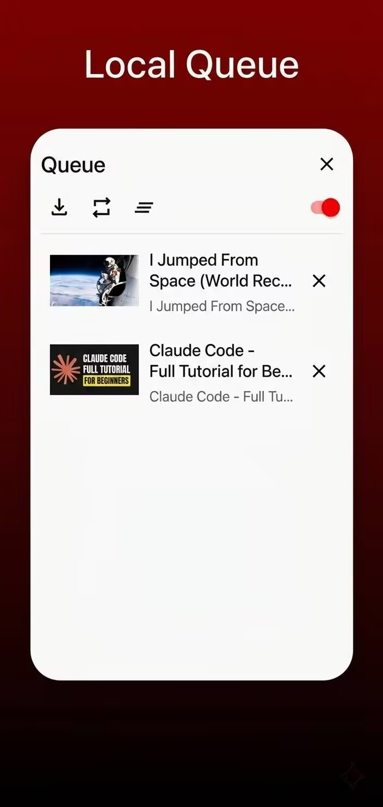

<div align="center">

# 📺 MeTube

**A feature-packed custom Android app & player for YouTube**  
*Made with ❤️ for a cleaner experience of YouTube by **estee***

[](LICENSE)
[](app/build.gradle.kts)
[](app/build.gradle.kts)
[](build.gradle.kts)
[](MODIFICATIONS.md)

[Key Features](#-key-features) • [Screenshots](#-screenshots) • [Installation & Building](#-installation--building) • [What's New](#-modifications--enhancements) • [Credits](#-credits--acknowledgements) • [License](#-license)

---

</div>

## 📌 Overview

**MeTube** is an open-source Android application designed to provide a sleek, ad-free, and privacy-respecting YouTube experience. Built with native Media3/ExoPlayer integration and NewPipeExtractor capabilities, MeTube combines fluid navigation with desktop- and native-grade features.

> [!NOTE]
> MeTube is a modified fork built on top of [Litube](https://github.com/HydeYYHH/litube) (v2.1.4 by HydeYYHH) under the GPL-3.0 license.

---

## ✨ Key Features

| Feature | Description |
| :--- | :--- |
| 🛡️ **Ad-Free Playback** | Native ad-blocking pipeline for uninterrupted video streaming. |
| ⏩ **SponsorBlock** | Automatically skips video sponsors, intros, outros, and self-promotions. |
| 🕵️ **Floating Incognito Toggle** | Quick-switch button to browse without saving history/cookies while preserving your main login session. |
| 🖼️ **Picture-in-Picture & Background Play** | Continue listening or watching videos seamlessly while using other apps or with screen off. |
| 🖐️ **Gesture Controls & Lock** | Swipe for volume/brightness/seeking, with a touch lock button to freeze all gestures during playback. |
| 🔽 **Swipe-to-Minimize & Drag Dismiss** | Swipe down on video player to minimize to in-app mini-player; drag mini-player to bottom dismiss target. |
| ⬇️ **Built-in Video & Playlist Downloader** | Download videos and playlists locally for offline viewing and playback. |
| 💬 **Live Chat Support** | Full interactive live stream chat integration. |
| 🎨 **Injected UI Polish** | Layout-safe stylesheet (`modern.css`) giving YouTube smooth scrolling, rounded thumbnails, and sleek aesthetics. |
| 🚀 **Android 12+ Splash Screen** | Modern native splash launcher using `androidx.core:core-splashscreen`. |

---

## 🖼️ Screenshots

<div align="center">

| Home & Feed | Player Controls | Features & Settings |
| :---: | :---: | :---: |
|  |  |  |

</div>

---

## 🚀 Modifications & Enhancements Over Upstream

MeTube extends upstream Litube with several high-value native features:

1. **Floating Incognito Toggle**: Draggable semi-transparent toggle to temporarily clear session cookies (browsing as guest) and restore signed-in session when toggled off.
2. **Native Launch Splash Screen**: Integrated Android 12 SplashScreen API backport for seamless cold starts.
3. **Player Gesture Lock**: Lock button on player overlay to prevent accidental touches, swipe seeking, or volume changes.
4. **Swipe-Down Minimization**: Downward center swipe on active video smoothly transitions into the floating mini-player.
5. **Drag-to-Dismiss Mini Player**: Dragging the mini-player reveals a bottom dismissal zone with animated opacity feedback.
6. **Modern CSS Engine**: Custom styling (`app/src/main/assets/style/modern.css`) automatically injected for visual polish.

For detailed file-level changes, see [MODIFICATIONS.md](MODIFICATIONS.md).

---

## 🛠️ Building from Source

### Prerequisites
- **Android Studio**: Ladybug / Jellyfish or newer recommended.
- **JDK**: Java 17 minimum.
- **Android SDK**: API level 36 (Min SDK: 26 / Android 8.0).

### Build Command

To compile a debug APK using Gradle:

```bash
# Unix / macOS
./gradlew :app:assembleDebug

# Windows PowerShell / CMD
.\gradlew.bat :app:assembleDebug
```

The generated APK will be available at:
`app/build/outputs/apk/debug/app-debug.apk`

### Low-Memory Build Configuration

If building on low-resource machines (≤ 4GB RAM), append the following flags to your `gradle.properties`:

```properties
org.gradle.workers.max=1
kotlin.compiler.execution.strategy=in-process
org.gradle.jvmargs=-Xmx1800m -XX:MaxMetaspaceSize=512m -Dfile.encoding=UTF-8
```

---

## 📂 Project Architecture

```
MeTube/
├── app/
│   ├── src/main/
│   │   ├── java/com/hhst/youtubelite/   # Core app source code
│   │   │   ├── browser/                 # IncognitoManager, WebEngine & WebView handling
│   │   │   ├── player/                  # ExoPlayer integration, Mini-player & Gestures
│   │   │   └── ui/                      # Activities, ViewHolders & Dialogs
│   │   ├── assets/style/modern.css      # Injected web UI enhancement stylesheet
│   │   └── res/                         # Android layouts, drawables, strings, splash themes
│   └── build.gradle.kts                 # Application build config & dependencies
├── fastlane/                            # App metadata & screenshots
├── MODIFICATIONS.md                     # Detailed changelog of MeTube customizations
└── README.md                            # Project documentation
```

---

## 🙏 Credits & Acknowledgements

- **estee** — Creator and maintainer of MeTube.
- **HydeYYHH** — Original creator of [Litube](https://github.com/HydeYYHH/litube), upon which MeTube is built and enhanced.

---

## 📜 License

Distributed under the **GNU General Public License v3.0 (GPL-3.0)**.  
See [`LICENSE`](LICENSE) for full details.

```
MeTube - Advanced YouTube Client for Android
Copyright (C) 2026 estee & MeTube Contributors
Based on Litube by HydeYYHH (https://github.com/HydeYYHH/litube)
```

---

<div align="center">

⭐ **If you find MeTube useful, consider starring the repository!** ⭐

</div>
